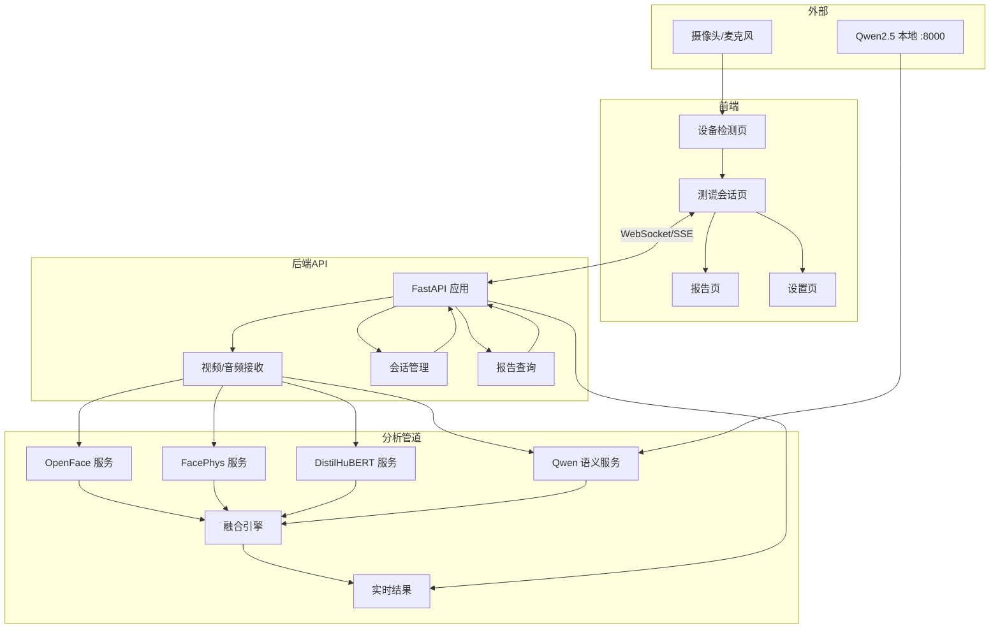
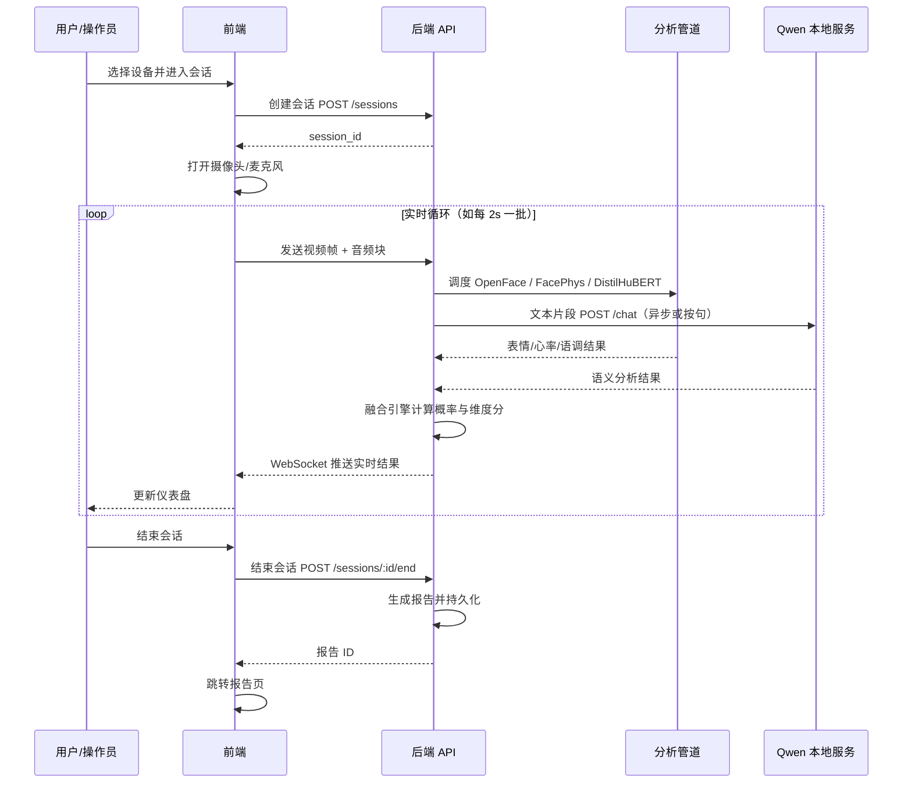
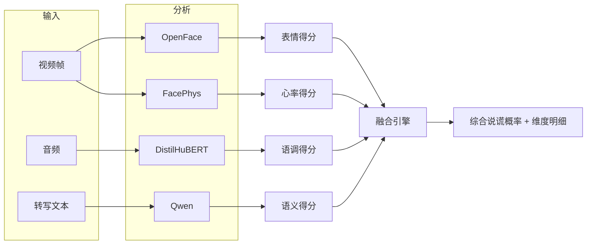
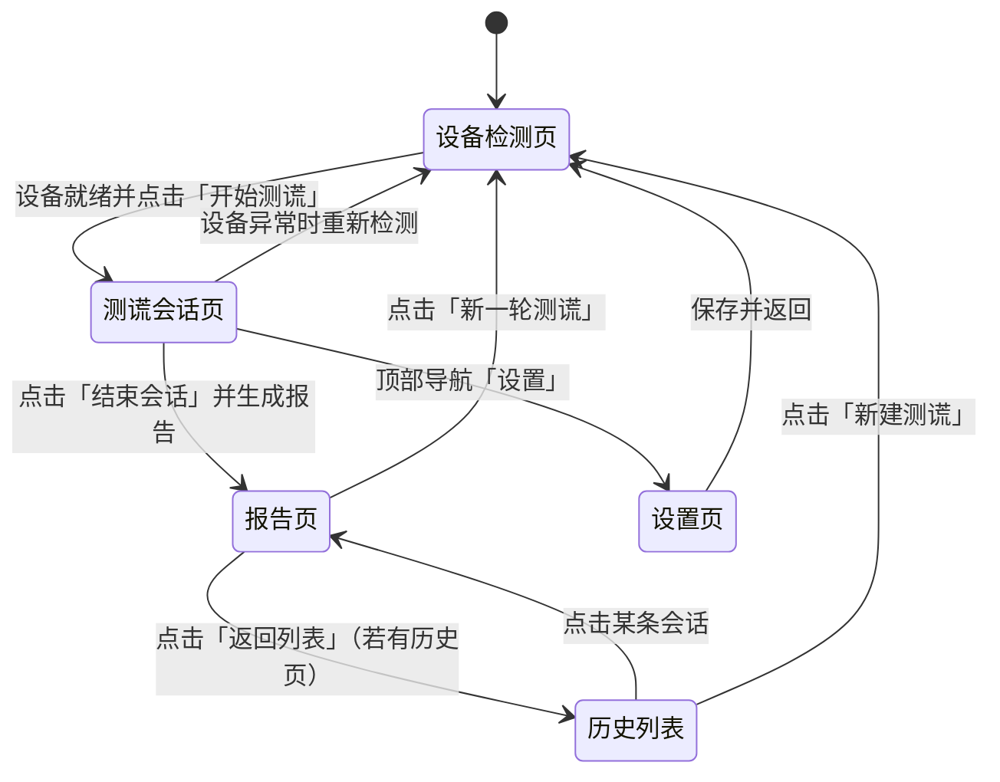
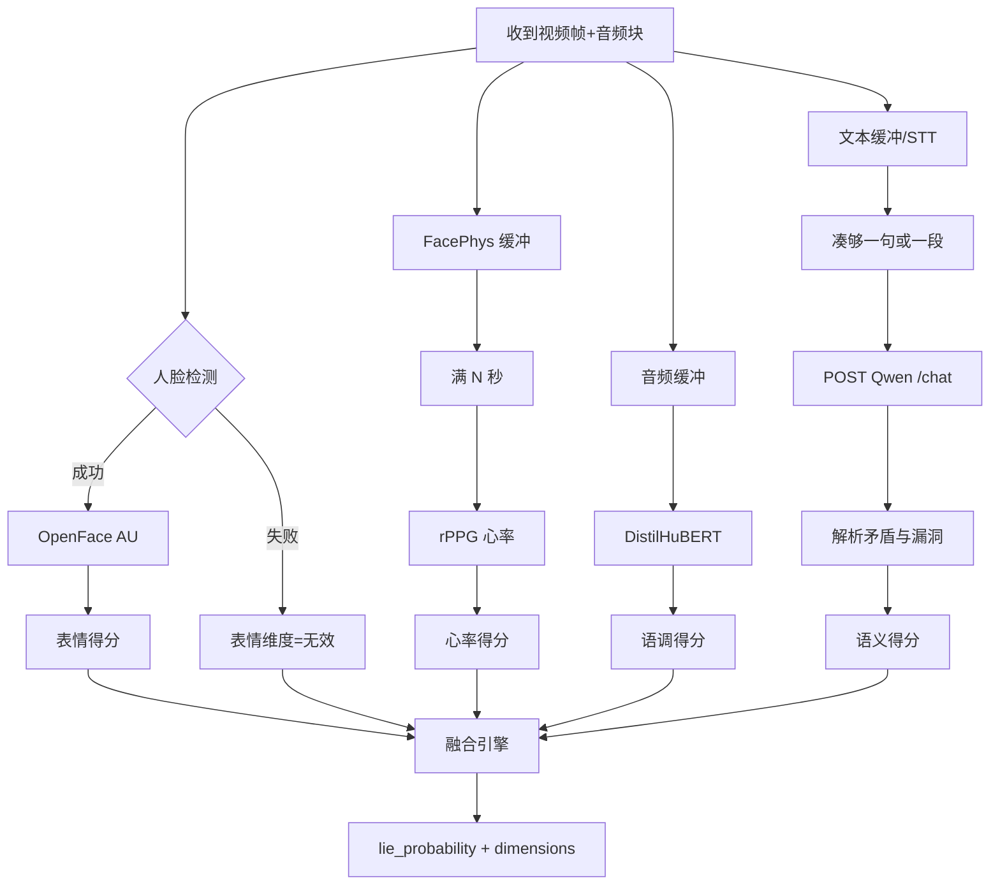

# 测谎系统（实时多模态分析）产品需求文档 PRD

> 文档版本：v1.0  
> 目标读者：开发团队、AI 编程工具（如 ibecoding）  
> 设计风格：简约工业风，AI 友好结构化  
> **本 PRD 为唯一需求文档，所有内容集中在此文件，便于管理。**

---

## 文档目录（快速导航）

| 章节 | 内容 |
|------|------|
| §一 | 项目概述（定位、价值、术语） |
| §二 | 技术栈与模块 |
| §三 | 系统架构与流程图（含全部 Mermaid 图） |
| §四 | 页面与路由（清单、跳转、各页功能说明） |
| §五 | 详细功能说明（设备、采集、四类分析、融合、会话与报告） |
| §六 | UI/UX 规范（简约工业风：色彩、字体、组件、布局） |
| §七 | 接口约定（REST、WebSocket、数据模型、结构化 YAML 规格） |
| §八 | 项目目录结构建议 |
| §九 | 非功能需求 |
| §十 | 附录（流程图与规格索引） |

---

## 一、项目概述

### 1.1 产品定位

基于**实时视频监控**的多模态测谎系统：通过摄像头采集被测人视频与语音，融合**表情/微表情（OpenFace）**、**心率（FacePhys）**、**语调（DistilHuBERT）**、**语义逻辑（本地 Qwen2.5）** 四类信号，实时计算说谎概率并给出可解释的维度得分。

### 1.2 核心价值

- **多模态融合**：不依赖单一指标，降低误判。
- **实时反馈**：检测过程实时展示各维度指标与综合结论。
- **可解释性**：展示“表情异常”“心率升高”“语调紧张”“语义矛盾”等分项依据。
- **本地部署**：敏感数据不出本地，语义分析使用已部署的 Qwen2.5-7B-Instruct。

### 1.3 关键术语

| 术语 | 说明 |
|------|------|
| 被测人 | 面对摄像头接受测谎分析的对象 |
| 会话(Session) | 一次完整的测谎流程：设备检测 → 开始 → 实时分析 → 结束并生成报告 |
| 维度/通道 | 表情、心率、语调、语义 四个分析维度 |
| 说谎概率 | 系统输出的 0–100% 综合指标 |

---

## 二、技术栈与模块

### 2.1 技术栈总览

```yaml
前端:
  - 技术: React / Vue 或 纯 HTML+JS (任选其一，便于 AI 生成)
  - 风格: 简约工业风，深色主色 #1a1a1a，强调色 #4a9eff，等宽/工业字体
  - 实时: WebSocket 或 Server-Sent Events 接收实时分析结果

后端/服务:
  - API 层: FastAPI (Python 3.10+)
  - 视频流: 接收前端或本地摄像头视频帧（Base64/二进制），按帧调用分析管道

分析管道 (Python):
  - 表情/微表情: OpenFace (面部动作单元 AU、凝视等)
  - 心率: FacePhys (rPPG 从面部视频估计心率/HRV)
  - 语调: DistilHuBERT 或 wav2vec2 (语音特征/情绪相关)
  - 语义: 本地 Qwen2.5-7B-Instruct HTTP 接口 (已有 qwen2_5_7b_server.py，端口 8000)

存储 (可选):
  - 会话与报告: SQLite 或 JSON 文件；如需多用户可扩展为 PostgreSQL
```

### 2.2 模块与依赖

| 模块 | 职责 | 输入 | 输出 | 备注 |
|------|------|------|------|------|
| openface_service | 人脸检测 + AU/微表情 | 单帧图像 (RGB) | AU 强度、头姿、凝视等 | 需 OpenFace 可执行或 Python 绑定 |
| facephys_service | rPPG 心率估计 | 短时视频片段 | 心率 BPM、HRV 相关 | FacePhys 或类似 rPPG 库 |
| distilhubert_service | 语音特征/语调 | 音频片段 (WAV/raw) | 特征向量或情绪/紧张度分数 | HuggingFace transformers |
| qwen_semantic_service | 语义逻辑分析 | 文本（被测人话语） | 逻辑漏洞、矛盾点、摘要 | 调用本地 http://localhost:8000/chat |
| fusion_engine | 多模态融合 | 各模块输出 + 时间戳 | 综合说谎概率 + 各维度得分 | 规则或轻量 ML 融合 |
| session_manager | 会话与报告 | 会话配置、时间范围 | 会话元数据、报告 JSON | 创建/结束会话、存储 |

---

## 三、系统架构与流程图

### 3.1 系统架构图



### 3.2 测谎会话主流程（单次会话）



### 3.3 数据流（多模态汇总）



### 3.4 页面状态与跳转



### 3.5 单次分析管道内部流程



---

## 四、页面与路由

### 4.1 页面清单

| 页面 ID | 路由 | 名称 | 说明 |
|---------|------|------|------|
| P1 | `/` 或 `/device-check` | 设备检测页 | 检测摄像头、麦克风可用性，选择设备后进入会话 |
| P2 | `/session` | 测谎会话页 | 实时视频预览 + 四维度指标仪表盘 + 开始/结束按钮 |
| P3 | `/report/:id` | 报告页 | 展示某次会话的完整报告（曲线、维度分、语义摘要） |
| P4 | `/settings` | 设置页 | 服务器地址、Qwen 端口、采样间隔等 |
| P5 | `/history` | 历史列表（可选） | 会话列表，点击进入报告 |

### 4.2 各页面功能说明与跳转

#### P1 设备检测页 (`/` 或 `/device-check`)

- **功能要点**：自动检测摄像头/麦克风列表并下拉选择；实时预览；显示检测状态（OK/失败）；按钮「开始测谎」仅在摄像头+麦克风均可用时可点，跳转 `/session`。
- **交互**：从根路径进入即本页；选择设备后状态实时更新，需用户点击「开始测谎」才跳转。

#### P2 测谎会话页 (`/session`)

- **功能要点**：顶部会话 ID、开始时间、按钮「结束会话」；主区域实时视频预览；四维度实时指标（表情、心率、语调、语义）；综合「说谎概率」仪表盘；可选实时转写。
- **交互**：进入时自动创建会话并建立 WebSocket/SSE；「结束会话」→ 调用结束接口 → 跳转 `/report/:id`；导航可进「设置」。

#### P3 报告页 (`/report/:id`)

- **功能要点**：报告头（会话 ID、时间、时长）；综合结论（平均/峰值说谎概率、等级）；分维度曲线或表格；语义发现列表（可折叠）；「返回列表」「新一轮测谎」。
- **交互**：直接访问 `/report/:id` 可查看历史；id 无效则 404 或跳转历史列表。

#### P4 设置页 (`/settings`)

- **功能要点**：后端 API base URL、Qwen 地址与端口（默认 localhost:8000）、采样间隔、是否启用语义等；保存后写入本地或后端。
- **交互**：保存 → 提示成功 → 返回上一页或设备检测页。

#### P5 历史列表页 (`/history`)（可选）

- **功能要点**：会话列表（ID、开始时间、时长、结论摘要）；点击行 → `/report/:id`；「新建测谎」→ 设备检测页。

---

## 五、详细功能说明

### 5.1 设备检测

- **摄像头**：`navigator.mediaDevices.getUserMedia({ video: true })` 与 `enumerateDevices()` 过滤 `videoinput`；预览当前设备，失败时禁用「开始测谎」。
- **麦克风**：同上 `audio: true` 与 `audioinput`；可选音量条（AnalyserNode）证明有效。

### 5.2 视频与音频采集

- **视频**：按间隔（如 2s）从 video 抓帧（Canvas to Blob/Base64）或 MediaRecorder 按段上传；分辨率建议 640x480 或 320x240。
- **音频**：MediaRecorder 或 AudioWorklet 按块上传；后端支持 WAV/WebM 或 raw PCM；若接 STT 再送 Qwen，需定义 STT 接口。

### 5.3 表情分析（OpenFace）

- **输入**：单帧 RGB。**输出**：AU 强度、头姿、凝视等；建议字段 `expression_score`, `micro_expression_flags`, `au_codes`。与说谎的映射：AU 异常组合等规则映射为 0–1 得分。

### 5.4 心率分析（FacePhys）

- **输入**：短时视频（如 10–30s），ROI 为人脸。**输出**：BPM、HRV。与基线（会话前 30s）比较，超出阈值则提高 `heart_rate_score`（0–1）。

### 5.5 语调分析（DistilHuBERT）

- **输入**：音频片段。**输出**：紧张度/情绪分数或标签；建议字段 `tone_score`, `tension_level`。

### 5.6 语义分析（Qwen2.5 本地）

- **输入**：被测人话语文本（无 STT 时可操作员输入）。**请求**：POST 本地 `/chat`，system 提示词为分析逻辑漏洞与矛盾，user 为陈述内容；`max_new_tokens`: 256，`temperature`: 0.3。**输出**：解析为 `semantic_score` 与 `contradictions` 列表。按句或按段调用，避免过频。

### 5.7 融合引擎

- **输入**：四类维度当前值或短时均值。**逻辑**：加权求和或阈值组合，如 `lie_probability = w1*expression + w2*heart_rate + w3*tone + w4*semantic`，权重可配置。**输出**：`lie_probability`（0–1 或 0–100%）及 `dimensions` 各 0–1。

### 5.8 会话与报告

- **会话**：POST `/sessions` 创建返回 `session_id`；POST `/sessions/:id/end` 结束并触发报告。
- **报告**：GET `/sessions/:id/report`；内容含会话元数据、时间序列、语义发现；存储为 SQLite 或 JSON。

---

## 六、UI/UX 规范（简约工业风）

### 6.1 设计原则

- **简约**：少装饰、少渐变，以线框与留白区分层次。
- **工业感**：深色底、等宽/技术字体、直角或小圆角、清晰的数据展示。
- **可读性**：对比度充足，关键数字大而清晰，状态用颜色区分。

### 6.2 色彩

| 用途 | 变量名 | 色值 |
|------|--------|------|
| 主背景 | --bg-primary | #1a1a1a |
| 次级背景 | --bg-secondary | #252525 |
| 主操作/强调 | --primary | #4a9eff |
| 主操作悬停 | --primary-hover | #6bb0ff |
| 成功/正常 | --success | #2ecc71 |
| 警告 | --warning | #f39c12 |
| 异常/高风险 | --danger | #e74c3c |
| 边框/分割线 | --border | #333 |
| 正文 | --text | #e0e0e0 |
| 次要文字 | --text-muted | #888 |

### 6.3 字体与布局

- **字体**：标题/数字/代码用 JetBrains Mono, SF Mono, Consolas；正文同族或 system-ui。字号：12px（辅助）、14px（正文）、18px（小标题）、24px（大标题/大数字）。
- **布局**：主容器最大宽度 1400px，内边距 24px；卡片间距 16–24px，圆角 2–4px。

### 6.4 组件约定

- **按钮**：主按钮填充 `--primary`，次按钮描边；危险操作用 `--danger`。
- **卡片**：背景 `--bg-secondary`，边框 1px solid `--border`，内边距 16–24px。
- **实时指标**：数字 18–24px 等宽字体，下方短标签；异常时用 `--warning`/`--danger`。
- **视频预览**：保持比例，深色边框，可选「LIVE」角标。
- **说谎概率仪表**：半圆或线性仪表，单色填充，阈值线区分；或大数字+进度条+「低/中/高」。
- **报告曲线**：单色折线，坐标轴/网格 `--border`，图例简洁。

### 6.5 响应式与无障碍

- 最小支持宽度 1280px；移动端可后续迭代。
- 关键按钮与状态具备 label/aria-label；色彩不单独传达信息，配合文字或图标。

---

## 七、接口约定（便于 AI 实现）

### 7.1 REST 摘要

| 方法 | 路径 | 说明 |
|------|------|------|
| POST | /sessions | 创建会话，返回 session_id |
| POST | /sessions/:id/end | 结束会话，生成报告 |
| GET | /sessions/:id/report | 获取会话报告 |
| GET | /sessions | 历史会话列表（可选） |
| POST | /analyze/frame | 上传单帧或短片段（若采用轮询而非 WebSocket） |

### 7.2 WebSocket 事件（推荐）

- **客户端 → 服务端**：`{ "type": "frame", "session_id": "...", "video_base64": "...", "audio_base64": "..." }`。
- **服务端 → 客户端**：`{ "type": "result", "session_id": "...", "lie_probability": 0.35, "dimensions": { "expression": 0.2, "heart_rate": 0.5, "tone": 0.3, "semantic": 0.4 }, "semantic_summary": "未发现明显矛盾" }`。
- 心跳：每 30s ping/pong。

### 7.3 数据模型示例

**Session**：`id`, `created_at`, `ended_at`, `status`（active|ended）, `report_id`。

**Report**：`id`, `session_id`, `summary`（average_lie_probability, peak_lie_probability, level）, `timeline`（t, lie_probability, expression, heart_rate, tone, semantic）, `semantic_findings`（text, severity）。

### 7.4 结构化规格（YAML，供 AI/工具解析）

```yaml
# 路由与页面
routes:
  - id: P1
    path: /
    alias: /device-check
    name: 设备检测页
    component: DeviceCheck
    entry: true
    actions: [{ id: start, label: 开始测谎, to: /session }]
  - id: P2
    path: /session
    name: 测谎会话页
    component: Session
    ws: true
    actions: [{ id: end, label: 结束会话, method: POST, path: /sessions/:id/end, to: /report/:reportId }, { id: settings, label: 设置, to: /settings }]
  - id: P3
    path: /report/:id
    name: 报告页
    component: Report
    params: [id]
    actions: [{ id: new, label: 新一轮测谎, to: / }, { id: list, label: 返回列表, to: /history }]
  - id: P4
    path: /settings
    name: 设置页
    component: Settings
    actions: [{ id: save, label: 保存 }, { id: back, label: 返回, to: / }]
  - id: P5
    path: /history
    name: 历史列表页
    component: History
    optional: true
    actions: [{ id: open, label: 查看报告, to: /report/:id }, { id: new, label: 新建测谎, to: / }]

# API
api:
  base: "{{API_BASE}}"
  ws_path: "/ws"
  rest:
    - { method: POST, path: /sessions, response: { session_id: string } }
    - { method: POST, path: /sessions/:id/end, params: [id], response: { report_id: string } }
    - { method: GET, path: /sessions/:id/report, params: [id], response: Report }
    - { method: GET, path: /sessions, response: Session[] }
  ws_events:
    client_to_server: [{ type: frame, payload: { session_id, video_base64?, audio_base64? } }, { type: ping }]
    server_to_client: [{ type: result, payload: { session_id, lie_probability, dimensions: { expression, heart_rate, tone, semantic }, semantic_summary } }, { type: pong }]

# Qwen 集成
qwen_integration:
  url: "http://localhost:8000"
  chat_path: "/chat"
  system_prompt: "你负责分析以下陈述，指出逻辑漏洞、前后矛盾或可疑之处，用简洁条目列出。"
  max_new_tokens: 256
  temperature: 0.3

# UI Tokens
ui_tokens:
  colors: { background: "#1a1a1a", background_secondary: "#252525", primary: "#4a9eff", primary_hover: "#6bb0ff", success: "#2ecc71", warning: "#f39c12", danger: "#e74c3c", border: "#333" }
  fonts: { mono: "JetBrains Mono, SF Mono, Consolas", sans: "system-ui, sans-serif" }
  spacing: [8, 16, 24]
  radius: 4
```

---

## 八、项目目录结构建议

```
cehuangxitong/
├── prd/
│   └── PRD.md                 # 本 PRD（唯一需求文档）
├── backend/
│   ├── main.py
│   ├── config.py
│   ├── routers/
│   │   ├── sessions.py
│   │   ├── reports.py
│   │   └── analyze.py
│   ├── services/
│   │   ├── openface_service.py
│   │   ├── facephys_service.py
│   │   ├── distilhubert_service.py
│   │   ├── qwen_semantic_service.py
│   │   └── fusion_engine.py
│   ├── models/
│   └── store/
├── frontend/
│   ├── index.html
│   ├── app.js / main.tsx
│   ├── pages/
│   │   ├── DeviceCheck.jsx
│   │   ├── Session.jsx
│   │   ├── Report.jsx
│   │   ├── Settings.jsx
│   │   └── History.jsx
│   ├── components/
│   └── api/
├── requirements.txt
├── README.md
└── .env.example
```

---

## 九、非功能需求

- **延迟**：帧/音频上传到该次结果目标 < 5s。
- **隐私**：视频/音频仅用于当前会话分析；报告可仅保留数值与摘要，不存原始流（可配置）。
- **可用性**：Qwen 不可用时语义维度置为“未可用”，其余三维度照常运行。

---

## 十、附录：流程图与规格索引

| 图/规格 | 本节位置 | 说明 |
|---------|----------|------|
| 系统架构图 | §3.1 | 前端、后端、分析管道、外部服务 |
| 测谎会话主流程 | §3.2 | 会话从创建到报告生成的时序 |
| 多模态数据流 | §3.3 | 视频/音频/文本 → 四维度 → 融合 |
| 页面状态与跳转 | §3.4 | 各页面状态与跳转关系 |
| 单次分析管道内部流程 | §3.5 | 帧/音频进入后各服务与融合引擎的流程 |
| 结构化 YAML 规格 | §7.4 | 路由、API、Qwen 集成、UI tokens，供 AI/工具解析 |

— 文档结束。所有需求与规格均以本 PRD 为准，便于统一管理与迭代。
